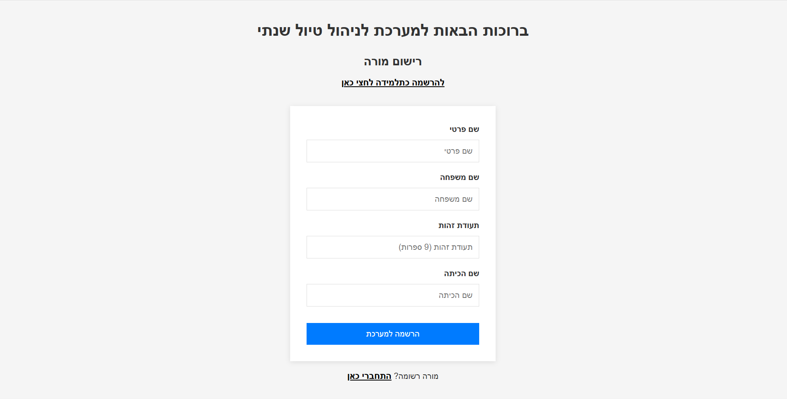
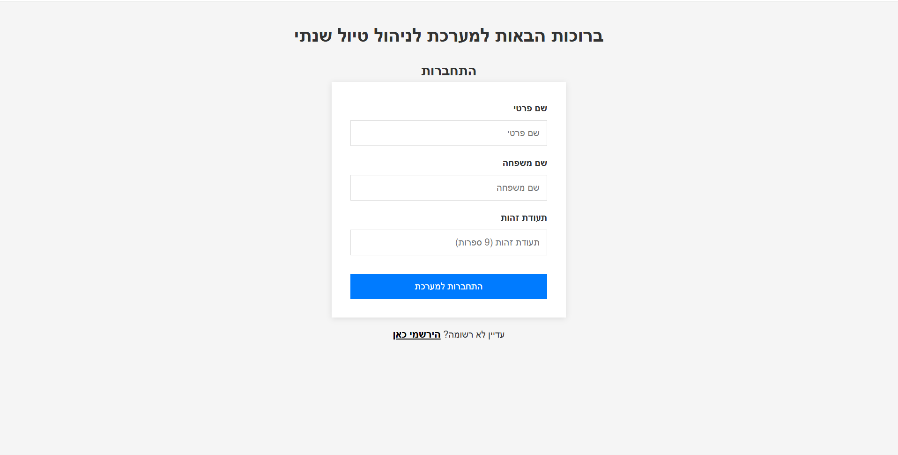
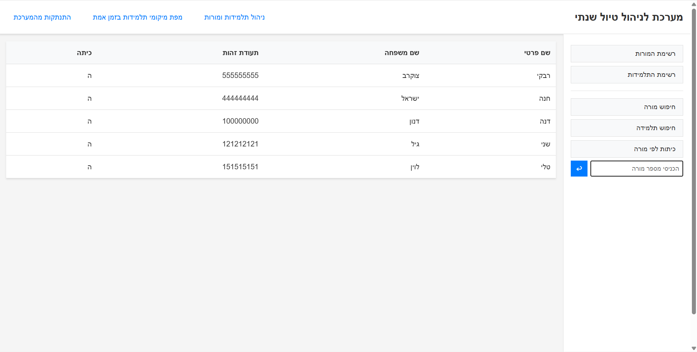
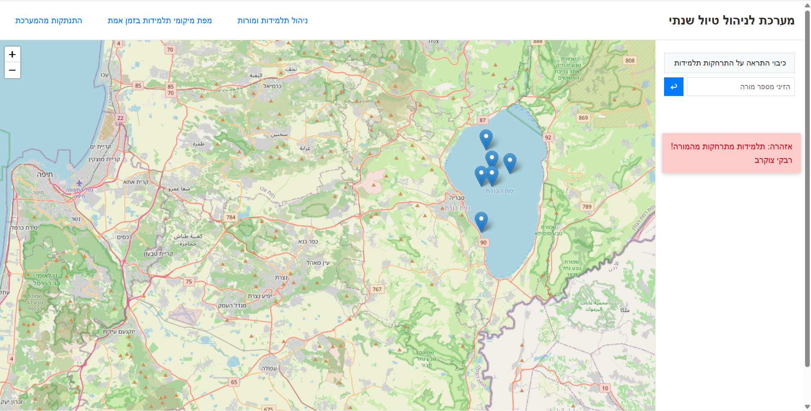
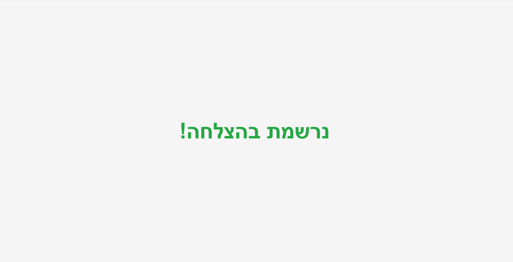

# Trip Management System

A full-stack real-time system for managing school trips, including live student tracking, teacher dashboards, and secure authentication.

## Table of Contents

- [Features](#features)
- [Usage](#usage)
- [Technologies Used](#technologies-used)
- [Prerequisites](#prerequisites)
- [Installation](#installation)
- [Running the Application](#running-the-application)
- [API Endpoints](#api-endpoints)
- [Database](#database)
- [License](#license)

## Features

- Teacher and student registration and teacher-only login authentication
- Teacher dashboard with student and teacher data display
- Real-time student location tracking on an interactive map
- Secure JWT-based authentication
- React frontend with Vite
- Node.js/Express backend with MongoDB

## Usage

### Registration
1. Open the application in your browser
2. Navigate to the registration page
3. Choose whether you are registering as a teacher or student
4. Fill in the required information
5. Submit the form



### Login
1. Go to the login page
2. Enter your teacher ID
3. Click login



### Teacher Dashboard
After logging in as a teacher, you will see the management dashboard where you can:
- View all registered students
- Add new students
- Edit student information
- Delete students



### Location Tracking
Teachers can access the locations page to view real-time location tracking of students on an interactive map.



### Student Success Page
Students see a success page after registration, confirming their registration.



## Technologies Used

### Frontend
- React 19
- Vite
- React Router DOM
- Leaflet (for maps)
- React Leaflet
- Socket.io Client (for real-time updates)

### Backend
- Node.js
- Express.js
- MongoDB with Mongoose
- JWT for authentication
- bcryptjs for password hashing
- Socket.io for real-time communication
- CORS

### Development Tools
- Concurrently (for running client and server together)
- Nodemon (for server auto-restart)
- ESLint

## Prerequisites

Before running this application, make sure you have the following installed:

- Node.js (version 16 or higher)
- npm (comes with Node.js)
- MongoDB Atlas account (or local MongoDB instance)

## Installation

1. Clone the repository:
   ```bash
   git clone https://github.com/TzippiTzukrov/trip-management-system.git
   cd trip-management-system
   ```

2. Install root dependencies:
   ```bash
   npm install
   ```

3. Install client dependencies:
   ```bash
   cd client
   npm install
   cd ..
   ```

4. Install server dependencies:
   ```bash
   cd server
   npm install
   cd ..
   ```

5. Set up environment variables - create a `.env` file in the `server` directory with the following:
   ```
   MONGO_URI=your_mongodb_connection_string
   PORT=5000
   JWT_SECRET=your_secret_key
   ```

## Running the Application

To run both the client and server concurrently:

```bash
npm run dev
```

This will start:
- The React client on `http://localhost:5173` (or next available port)
- The Express server on `http://localhost:5000`

Alternatively, you can run them separately:

```bash
# Run server only
npm run server

# Run client only
npm run client
```

## API Endpoints

### Authentication Routes
- `POST /api/login` - Login with teacher ID

### Students Routes
- `POST /api/students` - Register a new student
- `GET /api/students` - Get all students (teacher only)
- `GET /api/students/:id` - Get student by ID (teacher only)

### Teachers Routes
- `POST /api/teachers` - Register a new teacher (returns token)
- `GET /api/teachers` - Get all teachers (teacher only)
- `GET /api/teachers/:id` - Get teacher by ID (teacher only)
- `GET /api/teachers/:id/students` - Get students of teacher's class (teacher only)

### Locations Routes
- `POST /api/locations` - Add or update a location
- `GET /api/locations` - Get all locations with names (teacher only)

## Database

The application uses MongoDB with the following collections:
- `teachers`
- `students`
- `locations`

Make sure your MongoDB instance is running and accessible via the connection string in the `.env` file.

## License

This project is licensed under the ISC License.
